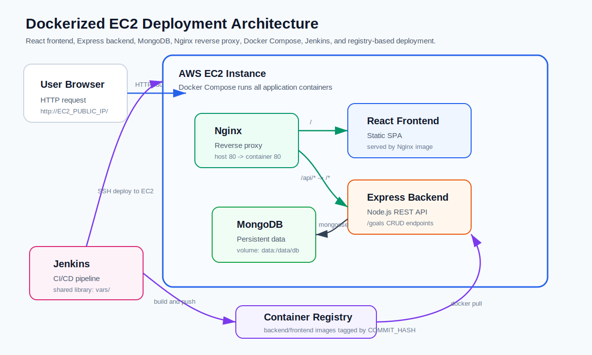
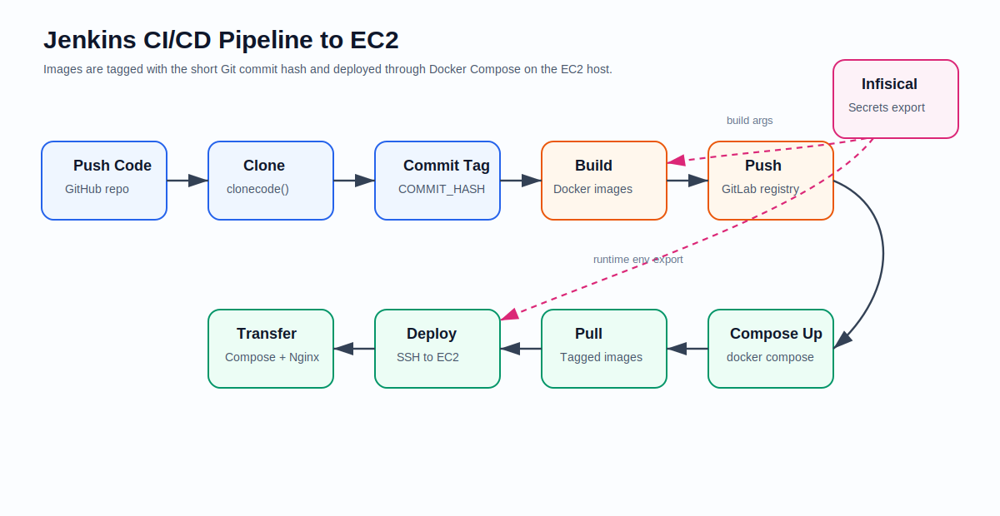
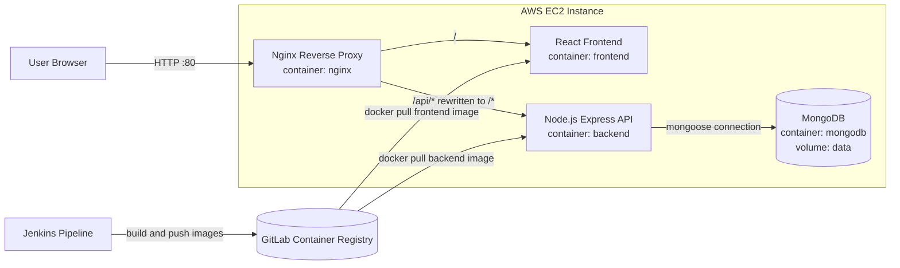
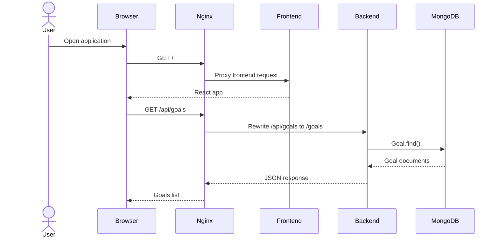
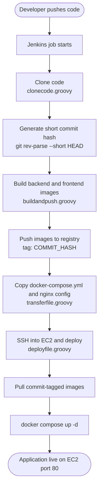
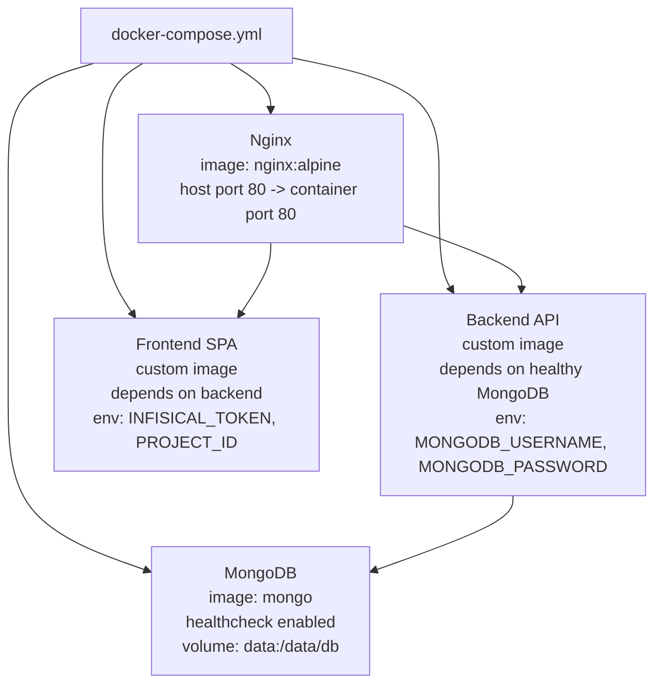

# EC2 Dockerized DevOps Deployment

This project is a fully Dockerized MERN-style application deployed to an AWS EC2 instance through a Jenkins CI/CD pipeline. It contains a React frontend, Node.js/Express backend, MongoDB database, Nginx reverse proxy, Docker Compose orchestration, and Jenkins shared-library functions for reusable pipeline stages.

## Project Highlights

- **Frontend:** React single-page app served by an Nginx container.
- **Backend:** Express API with MongoDB persistence through Mongoose.
- **Database:** MongoDB container with persistent Docker volume storage.
- **Reverse proxy:** Nginx exposes the app on port `80` and routes API traffic to the backend.
- **Containerization:** Separate Dockerfiles for frontend and backend, orchestrated with Docker Compose.
- **CI/CD:** Jenkins builds, tags, pushes, transfers, and deploys the application to EC2.
- **Secrets:** Infisical is used by the Docker build and deployment pipeline for secret injection.
- **Shared library:** Jenkins logic is split into reusable functions under `vars/`.

## Visual Diagrams

### Deployment Architecture



### Jenkins CI/CD Pipeline



## Architecture Diagram



## Request Flow



## CI/CD Pipeline



## Runtime Containers



## Jenkins Shared Library Functions

```mermaid
flowchart LR
    jenkinsfile[Jenkinsfile<br/>@Library training-lib]

    jenkinsfile --> clonecode[clonecode]
    jenkinsfile --> buildandpush[buildandpush]
    jenkinsfile --> transferfile[transferfile]
    jenkinsfile --> deployfile[deployfile]

    buildandpush --> variables[variables]
    transferfile --> variables
    deployfile --> variables

    clonecode --> gitrepo[(GitHub Repository)]
    buildandpush --> registry[(Container Registry)]
    transferfile --> ec2[AWS EC2]
    deployfile --> ec2
    deployfile --> infisical[(Infisical Secrets)]
```

| File | Responsibility |
| --- | --- |
| `vars/clonecode.groovy` | Clones the configured Git repository and branch using Jenkins credentials. |
| `vars/buildandpush.groovy` | Logs in to the container registry, builds backend/frontend Docker images, tags them with `COMMIT_HASH`, and pushes them. |
| `vars/transferfile.groovy` | Connects to EC2 over SSH and copies `docker-compose.yml` plus the `nginx` config directory. |
| `vars/deployfile.groovy` | Fetches Infisical secrets, logs in to the registry from EC2, pulls the commit-tagged images, exports runtime variables, and runs Docker Compose. |
| `vars/variables.groovy` | Central configuration for registry, namespace, EC2 host/user, target directory, Infisical project, and environment. |

## Repository Structure

```text
.
├── Jenkinsfile                 # Main Jenkins pipeline
├── docker-compose.yml          # EC2 runtime orchestration
├── docker-commands.txt         # Manual Docker command notes
├── backend/
│   ├── Dockerfile              # Backend image build
│   ├── app.js                  # Express API and MongoDB connection
│   ├── models/goal.js          # Mongoose Goal model
│   └── package.json
├── frontend/
│   ├── Dockerfile              # Multi-stage React build served by Nginx
│   ├── package.json
│   ├── public/
│   └── src/
├── nginx/
│   └── default.conf            # Reverse proxy configuration
└── vars/
    ├── buildandpush.groovy
    ├── clonecode.groovy
    ├── deployfile.groovy
    ├── transferfile.groovy
    └── variables.groovy
```

## Application Endpoints

| Method | Route through Nginx | Backend route | Purpose |
| --- | --- | --- | --- |
| `GET` | `/api/goals` | `/goals` | Fetch all goals. |
| `POST` | `/api/goals` | `/goals` | Create a new goal. |
| `DELETE` | `/api/goals/:id` | `/goals/:id` | Delete a goal by MongoDB document id. |

## Deployment Configuration

The pipeline uses the values from `vars/variables.groovy`:

| Key | Purpose |
| --- | --- |
| `REGISTRY` | Container registry host. |
| `NAMESPACE` | Registry namespace for frontend and backend images. |
| `EC2_HOST` | Target EC2 public host/IP. |
| `EC2_USER` | SSH user used by Jenkins. |
| `TARGET_DIR` | Directory on EC2 where Compose files are placed. |
| `PROJECT_ID` | Infisical project id. |
| `INFISICAL_API_URL` | Infisical API endpoint. |
| `INFISICAL_ENV` | Infisical environment used for secret export. |

Required Jenkins credentials:

| Credential ID | Used for |
| --- | --- |
| `docker-cred` | Docker registry login. |
| `github-ssh-key` | Git repository checkout. |
| `ec2-arshik-key` | SSH/SCP access to EC2. |
| `infisical-token` | Exporting secrets from Infisical. |

## Local Docker Compose Run

Create the required environment variables before running Compose:

```bash
export MONGODB_USERNAME=max
export MONGODB_PASSWORD=secret
export COMMIT_HASH=<image-tag>
export INFISICAL_TOKEN=<token>
export PROJECT_ID=<infisical-project-id>
```

Start the stack:

```bash
docker compose up -d
```

Check containers:

```bash
docker compose ps
```

Stop the stack:

```bash
docker compose down
```

Open the app:

```text
http://<ec2-public-ip>/
```

## Deployment Flow Summary

1. Jenkins checks out the project.
2. Jenkins reads the short Git commit hash and uses it as the Docker image tag.
3. Backend and frontend images are built with Infisical build arguments.
4. Images are pushed to the GitLab container registry.
5. `docker-compose.yml` and `nginx/default.conf` are copied to EC2.
6. Jenkins SSHs into EC2, exports secrets and deployment variables, pulls the new images, and runs `docker compose up -d`.
7. Nginx serves the React app and proxies API calls to the backend.
8. Backend stores and retrieves goal data from MongoDB.

## Important Notes

- MongoDB data is persisted in the named Docker volume `data`.
- Nginx is the only service published to the host, using port `80`.
- Backend and frontend images are versioned by `COMMIT_HASH`, making each deployment traceable to a Git commit.
- `docker-compose.yml` expects `MONGODB_USERNAME`, `MONGODB_PASSWORD`, `COMMIT_HASH`, `INFISICAL_TOKEN`, and `PROJECT_ID` to be available in the shell where Compose runs.
- The backend listens on port `80` inside its container after connecting successfully to MongoDB.
- The frontend calls `/api/goals`, so API routing depends on the Nginx rewrite rule in `nginx/default.conf`.
